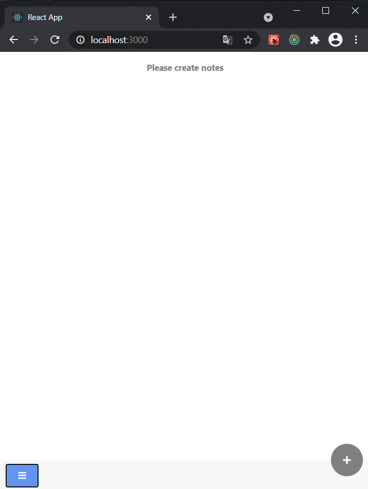
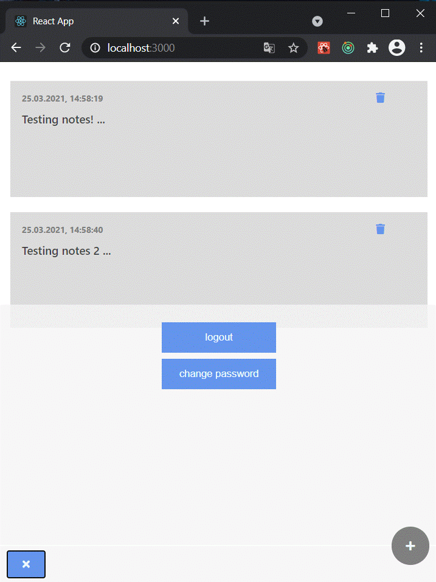
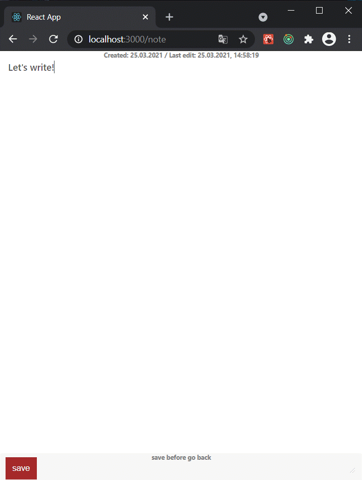

# Simply Note created with React/Node-Typescript
### The Application is designed to learn how to use react and node with typescript

## Table of contentss
* [Technologies](#technologies)
* [Setup](#setup)

## Technologies
The project was created with:
* Typescript
* React with Redux
* Node
* TypeORM / PostgreSQL
* Express

 



## Setup
Please download the project and extract it.
In both frontend and backend folders, run the command:
```
 npm install
```

First in frontend folder:
```
 npm start
```

And then in backend folder:
```
 npm run start:dev
```

## License 
### FREE